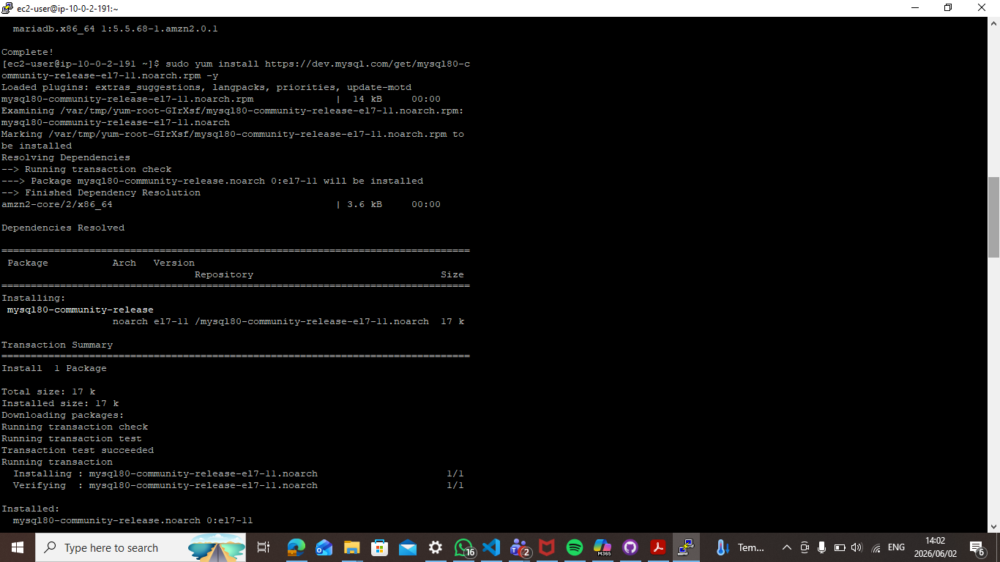
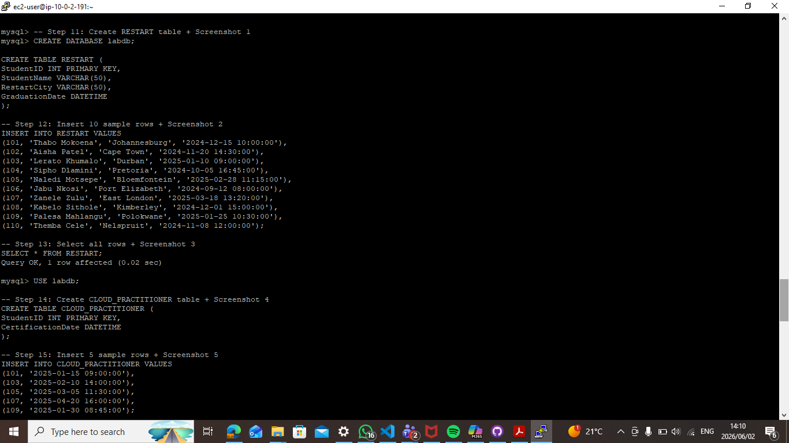
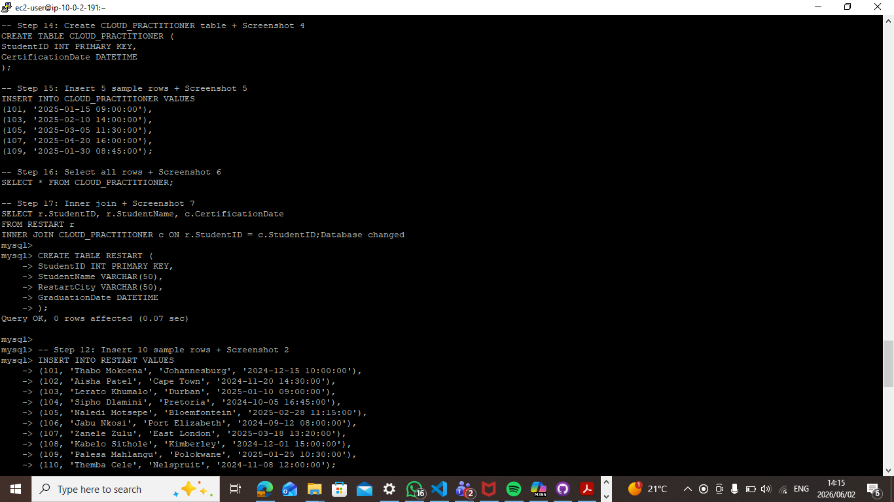

Build Your DB Server and Interact With Your DB Using an App
This lab is designed to reinforce the concept of leveraging an AWS-managed database instance for solving relational database needs.

Amazon Relational Database Service (Amazon RDS) makes it easy to set up, operate, and scale a relational database in the cloud. It provides cost-efficient and resizable capacity while managing time-consuming database administration tasks, which allows you to focus on your applications and business. Amazon RDS provides you with six familiar database engines to choose from: Amazon Aurora, Oracle, Microsoft SQL Server, PostgreSQL, MySQL and MariaDB.

Objectives

After completing this lab, you can:

Launch an Amazon RDS DB instance with high availability.

Configure the DB instance to permit connections from your web server.

Open a web application and interact with your database.

Duration

This lab takes approximately 45 minutes.

Scenario

You start with the following infrastructure:
architecture-lab1.png

At the end of the lab, this is the infrastructure:
architecture-lab2.png

Task 1: Create a Security Group for the RDS DB Instance
In this task, you will create a security group to allow your web server to access your RDS DB instance. The security group will be used when you launch the database instance.

In the AWS Management Console, in the search bar, type VPC and then select VPC.

In the left navigation pane, click Security groups.

Click Create security group and then configure:

Security group name: DB Security Group

Description: Permit access from Web Security Group

VPC: Select Lab VPC from the dropdown

You will now add a rule to the security group to permit inbound database requests. The security group currently has no rules. You will add a rule to permit access from the Web Security Group.

In the Inbound rules section, click Add rule, then configure:

Type: MySQL/Aurora (3306)

Source type: Custom

Source: Type sg in the search field and then select Web Security Group.

This configures the Database security group to permit inbound traffic on port 3306 from any EC2 instance that is associated with the Web Security Group.

Scroll to the bottom of the screen, then click Create security group

You will use this security group when launching the Amazon RDS database.

 

Task 2: Create a DB Subnet Group
In this task, you will create a DB subnet group that is used to tell RDS which subnets can be used for the database. Each DB subnet group requires subnets in at least two Availability Zones.

In the AWS Management Console, in the search bar, type RDS and then select Aurora and RDS.

In the left navigation pane, click Subnet groups.

 If the navigation pane is not visible, click the  menu icon in the top-left corner.

Click Create DB Subnet Group then configure:

Name: DB Subnet Group

Description: DB Subnet Group

VPC: Lab VPC

In the Add subnets section, for Availability Zones, choose the first and second Availability Zones from the dropdown.

For Subnets, select the following subnets:

10.0.1.0/24 (Private Subnet 1)

10.0.3.0/24 (Private Subnet 2)

Click Create

This adds Private Subnet 1 (10.0.1.0/24) and Private Subnet 2 (10.0.3.0/24). You will use this DB subnet group when creating the database in the next task.

 

Task 3: Create an Amazon RDS DB Instance
In this task, you will configure and launch a Multi-AZ Amazon RDS for MySQL database instance.

Amazon RDS Multi-AZ deployments provide enhanced availability and durability for Database (DB) instances, making them a natural fit for production database workloads. When you provision a Multi-AZ DB instance, Amazon RDS automatically creates a primary DB instance and synchronously replicates the data to a standby instance in a different Availability Zone (AZ).

In the left navigation pane, click Databases.

Click the dropdown arrow on Create database and select Full configuration.

Under Engine options, for Engine type, choose MySQL.

For Templates, choose Dev/Test.

For Availability and durability, choose Multi-AZ DB instance deployment (2 instances).

For Engine version, leave at default .

Under Settings, configure the following:

DB instance identifier: lab-db

Master username: main

Under Credential Settings, for Credentials management, select Self managed, then configure:

Clear the Auto generate a password checkbox if selected.

Master password: lab-password

Confirm master password: lab-password

For Additional credential settings, ensure Password authentication is selected.

Under Instance configuration, configure the following:

Select  Burstable classes (includes t classes).

Select db.t3.medium. 

Under Storage, configure:

For Storage type, select General Purpose SSD (gp3).

For Allocated storage: 20

Under Connectivity, configure:

For Compute resource, select Don't connect to an EC2 compute resource.

Virtual Private Cloud (VPC): Lab VPC

DB subnet group: DB Subnet Group

For Public access, select No.

For VPC security group (firewall), select Choose existing.

For Existing VPC security groups, use X to remove default, then select DB Security Group.

 

Under Monitoring, uncheck  Enable Enhanced monitoring

Under Performance Insights Uncheck   Enable Performance Insights.

Expand the  Additional configuration section and configure:

Initial database name: lab

Under Backup, uncheck  Enable automated backups.

 This will turn off backups, which is not normally recommended, but will make the database deploy faster for this lab.

Scroll to the bottom of the screen, then click Create database

Your database will now be launched.

Click lab-db (click the link itself).

You will now need to wait approximately 4 minutes for the database to be available. The deployment process is deploying a database in two different Availability zones.

 Note: If you are prompted with the Suggested add-ons for lab-db window, choose Close

 While you are waiting, you might want to review the Amazon RDS FAQs or grab a cup of coffee.

Wait until the Status changes to Modifying or Available.

Click on lab-db to view its details. Scroll down to the Connectivity & security tab and copy the Endpoint field.

Alternatively, you can choose View connection details at the top of the page to see the endpoint.

It will look similar to: lab-db.cggq8lhnxvnv.us-west-2.rds.amazonaws.com

Paste the Endpoint value into a text editor. You will use it later in the lab.

 

Task 4: Interact with Your Database
In this task, you will open a web application running on your web server and configure it to use the database.

Copy the WebServer IP address by selecting i AWS Details above these instructions you are currently reading.

Open a new web browser tab, paste the WebServer IP address and press Enter.

The web application will be displayed, showing information about the EC2 instance.

At the top of the web application page, click the RDS link.

A picture displaying the web application interface

Figure: A picture displaying the web application interface.

 

You will now configure the application to connect to your database.

Configure the following settings:

Endpoint: Paste the Endpoint you copied to a text editor earlier

Database: lab

Username: main

Password: lab-password

Click Submit

A message will appear explaining that the application is running a command to copy information to the database. After a few seconds the application will display an Address Book.

The Address Book application is using the RDS database to store information.

Test the web application by adding, editing and removing contacts.

The data is being persisted to the database and is automatically replicating to the second Availability Zone.
Your Challenge
To finish the Challenge do the following:

Launch an Amazon RDS DB instance using either Amazon Aurora Provisioned DB or MySQL database engines. Make a note of the DB credentials, as it will be needed in next steps. Please note the following lab restrictions:

DatabaseEngine: Supported engines are Amazon Aurora or MySQL. Amazon Aurora serverless is not available.
Template: Choose Dev/Test or Free tier.
Availability and durability: Avoid creating a standby instance.
DB instance size: Choose Burstable classes - db.t3 instances of type db. t*.micro to db.t*.medium.
Storage: Choose General Purpose SSD (gp2) of a size up to 100 GB. Provisioned IOPS access is restricted.
Amazon VPC: Use the Lab VPC
Security Group: Include a security group that will allow the LinuxServer to connect to the RDS instance.
For MySQL, under Additional configuration - Enable Enhanced monitoring - Disable the option
Purchasing Options: On-Demand instances are allowed. Other purchasing options are disabled.
Click the Details  followed by Show.

Click Download PEM (for Linux or macOS) or Download PPK (for Windows) depending on your local operating system.

Make a note of the LinuxServer address.

Connect (SSH) to the LinuxServer using the details you made a note of.

Install a MySQL client, and use it to connect to your db. Some helpful information is available here

Create a table RESTART with the following columns – Capture screenshot for submission

Student ID (Number),
Student Name,
Restart City,
Graduation Date (Date Time)
Insert 10 sample rows into this table – Capture screenshot for submission

Select all rows from this table – Capture screenshot for submission

Create a table CLOUD_PRACTITIONER with the following columns – Capture screenshot for submission

Student ID (Number)
certification date (Date Time)
Insert 5 sample rows into this table – Capture screenshot for submission

Select all rows from this table – Capture screenshot for submission

Perform an inner join between the 2 tables created above and display student ID, Student Name, Certification Date – Capture screenshot for submission   
 

 

 
